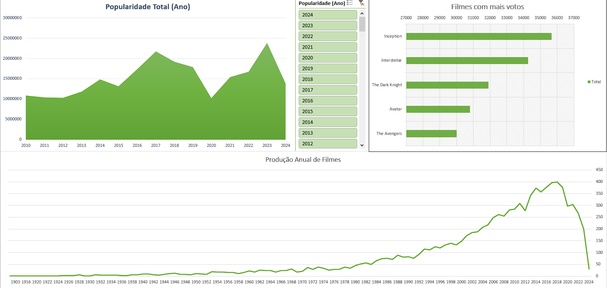

# Projeto de Análise de Banco de Dados de Filmes

## Descrição
Este projeto foi realizado para treinar e demonstrar minhas habilidades no Excel, utilizando um conjunto de dados de filmes disponível no Kaggle para extrair insights relevantes sobre popularidade, lançamentos e votos recebidos. As análises foram realizadas utilizando técnicas de limpeza de dados e visualização para criar um dashboard informativo.

## Fonte de Dados
O conjunto de dados utilizado pode ser encontrado no Kaggle: [Movies Dataset - TMDB](https://www.kaggle.com/datasets/vishnurajyadav12/movies-dataset-tmdb)

## Limpeza e Preparação dos Dados
1. **Limpeza de linhas nulas**: Remoção de registros com valores nulos para garantir a integridade dos dados.
2. **Retirada da coluna ID**: A coluna de ID foi removida por não ser necessária para as análises.
3. **Remoção de valores duplicados e colunas em branco**: Eliminação de registros duplicados e colunas sem dados relevantes.
4. **Inserção de colunas**:
   - **Ano**: Adição de uma coluna representando o ano de lançamento dos filmes.
   - **Popularidade Relativa**: Cálculo e inserção de uma coluna que representa a popularidade relativa dos filmes.

## Tabelas e Análises
1. **Tabela de Popularidade e Votos**: Criação de uma tabela contendo:
   - Popularidade média
   - Contagem total de votos
   - Contagem de filmes analisados
2. **Tabela de Busca de Filmes (PROCV)**: Pequena tabela criada para facilitar a busca de filmes específicos utilizando a função PROCV.
3. **Tabelas Dinâmicas e Gráficos**:
   - **Filmes com mais votos**: Gráfico de barras mostrando os filmes com o maior número de votos.
   - **Anos com mais lançamentos**: Gráfico de linha indicando os anos com maior quantidade de lançamentos de filmes.
   - **Anos mais populares**: Gráfico de linha mostrando os anos mais populares com base na soma da popularidade de todos os filmes lançados em cada ano.

## Ferramentas Utilizadas
- Microsoft Excel para limpeza de dados, criação de tabelas dinâmicas e construção dos gráficos.
- Funções de Excel como PROCV para facilitar a busca de informações específicas dentro do conjunto de dados.

## Dashboard

## Conclusão
Este projeto oferece uma visão sobre tendências de popularidade e lançamentos de filmes ao longo dos anos. As análises ajudam a identificar quais filmes receberam mais votos, quais anos tiveram mais lançamentos e quais foram os anos mais populares em termos de popularidade acumulada dos filmes.

